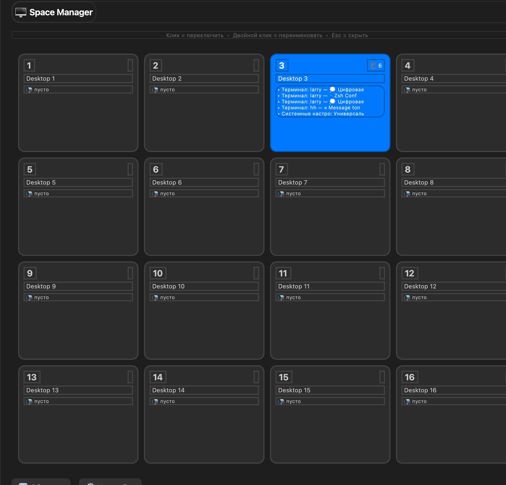

# 🖥️ Space Manager — Коллекция инструментов для macOS Spaces

Набор решений для управления рабочими столами (Spaces) в macOS.

## 📁 Структура

```
space-manager/
├── hammerspoon/     # 🥇 Основное решение — Menubar
├── sketchybar/      # 🥈 Альтернатива — Status bar
├── stickies/        # 🥉 Утилиты — Заметки с окнами
└── pyqt/            # 🔧 Legacy — GUI приложение
```

---

## 🥇 Hammerspoon (Рекомендуется)

**Menubar с названиями Spaces и списком окон.**

### Возможности:
- 📍 Показывает название текущего Space в меню баре
- 📋 Hover на Space → submenu с окнами
- 🖱️ Клик на Space → переключение
- ✏️ Переименование Spaces
- 💾 Названия сохраняются между перезагрузками

### Установка:
```bash
# Установить Hammerspoon
brew install --cask hammerspoon

# Скопировать конфиг
cp hammerspoon/init.lua ~/.hammerspoon/
cp hammerspoon/space_names.json ~/.hammerspoon/

# Перезапустить Hammerspoon
```

### Использование:
- Кликни на 📍 в меню баре
- Наведи на Space — увидишь окна
- Кликни — переключишься
- "✏️ Переименовать" — задай своё название

---

## 🥈 SketchyBar

**Кастомный status bar с Spaces.**

### Установка:
```bash
brew tap FelixKratz/formulae
brew install sketchybar

cp -r sketchybar/* ~/.config/sketchybar/
brew services start sketchybar
```

---

## 🥉 Stickies

**Скрипты для отображения списка терминалов в Stickies.**

### Скрипты:
- `terminals` — показать все окна Terminal
- `terminals-here` — показать окна Terminal на текущем Space

### Установка:
```bash
cp stickies/terminals ~/bin/
cp stickies/terminals-here ~/bin/
chmod +x ~/bin/terminals*
```

---

## 🔧 PyQt (Legacy)

**GUI приложение на PyQt6 — полный Space Manager.**



### Возможности:
- Карточки для каждого Space
- Список окон с иконками приложений
- Drag & drop окон между Spaces (WIP)
- Hotkey: Ctrl+`

### Установка:
```bash
cd pyqt
pip install -r requirements.txt
./run.sh
```

### Keyboard Shortcuts

| Shortcut | Action |
|----------|--------|
| `Ctrl+`` | Show/hide Space Manager |
| `1-9` | Switch to desktop 1-9 |
| `Esc` | Hide the window |

---

## 🛠️ Требования

- macOS 12+ (Monterey)
- Apple Silicon (M1/M2/M3) или Intel
- Для Hammerspoon: Accessibility permissions

---

## 📝 Лицензия

MIT

## 👤 Автор

Created by Claire (AI) for Larry.
[@nglain](https://github.com/nglain)
